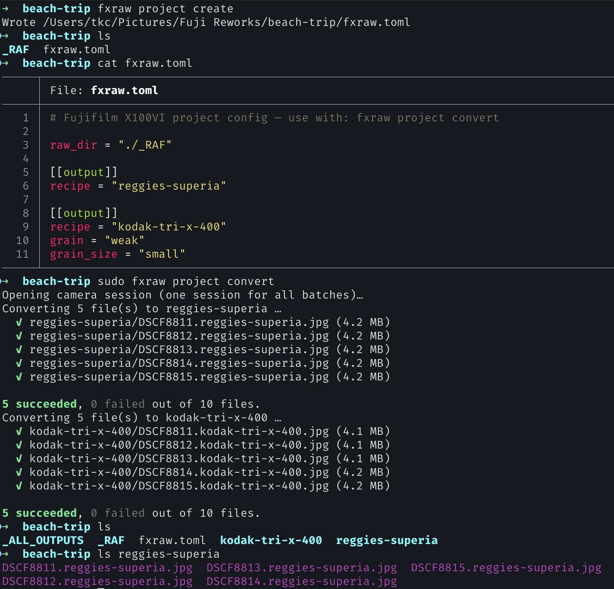

# fxraw

A CLI tool for working with Fujifilm raw files and jpegs. Connects to a real
camera over USB (currently only x100vi tested), and replicates a lot of Fuji X
RAW Studio's features, plus more.

- **Convert RAF files to JPEG on-camera:** over USB to a real image processor.
- **343+ film simulations built in:** list and convert to any recipe, or find
  out what recipe an existing photo used.
- **Convert to multiple recipes in bulk:** using [Project Mode](#project-mode)
  and a `fxraw.toml` file.
- **Override individual settings** like film simulation, grain, and more.


## Getting Started

```sh
$ mise run build # fxraw binary built in ./target/release.

$ fxraw recipes | grep retro
#  retro-color                         nostalgic-neg          DR400  6500K
#  retro-gold                          classic-chrome         DR400  fluorescent-3
#  retro-gold-low-contrast             classic-chrome         DR400  fluorescent-3
#  retro-negative-universal-negative   reala-ace              DR400  4000K

$ fxraw analyse DSCF0001.jpg
#   Film Simulation    classic-neg
#   Dynamic Range      DR100
#   Grain              strong / large
#   Color Effect       chrome:strong  blue:strong
#   …
#
# Closest recipes:
#   reggies-superia                     100.0%  (17.5/17.5)
#   magenta-negative                     66.7%  (13.0/19.5)
#   …

# Make a styled JPG from a raw. Real camera must be plugged in an on.
$ sudo fxraw convert photo.raf -r "kodak gold" -o gold.jpg

```

## Prerequisites

- MacOS (Probably, other platforms not tested)
- **Recommended:** [Mise](https://mise.jdx.dev/)
- Rust (`mise install`)
- [`exiftool`](https://exiftool.org/) (E.g. `brew install exiftool`)
- USB cable connected to a Fujifilm X100VI (for `convert` commands)

## Commands

### `fxraw recipes`

List recipe presets, custom ones (e.g. Classic Cuban Negative), and
Fuji-X-Weekly ones.

```
fxraw recipes
```

### `fxraw analyse`

Inspect a jpeg or raw file to identify what camera settings were used and

```sh
$ fxraw analyse DSCF0001.JPG # OR .RAF!

# DSCF0001.RAF
# ────────────
#   Film Simulation    classic-neg
#   Dynamic Range      DR100
#   Grain              strong / large
#   Color Effect       chrome:strong  blue:strong
#   White Balance      auto  R:+1 B:-3
#   Tone               highlight:-2  shadow:-1
#   Color              +1
#   Sharpness          -2
#   NR                 -4
#   Clarity            0
#   ISO                125
#   Exposure           +0.67
#
# Closest recipes:
#   reggies-superia                     100.0%  (17.5/17.5)
#   magenta-negative                     66.7%  (13.0/19.5)
#   classic-cuban-neg                    64.1%  (12.5/19.5)
#   pacific-blues                        64.1%  (12.5/19.5)
#   fujicolor-c200-v2                    61.5%  (12.0/19.5)
```

### `fxraw convert` (requires `sudo`)

Convert one or more RAF files to JPEG using the camera's image processor.
When multiple files are given, the camera session is opened once and reused.

```
fxraw convert photo.raf
fxraw convert photo.raf -o output.jpg
fxraw convert photo.raf -r kodak-tri-x-400
fxraw convert photo.raf -r "kodak gold" -o gold.jpg
fxraw convert photo.raf -f acros -g weak -o acros.jpg
fxraw convert photo.raf -r portra-400 -g strong --grain-size large -o grainy.jpg
fxraw convert *.raf -r portra-400
fxraw convert *.raf -r classic-chrome -o jpegs/
```

#### Options

| Flag                   | Description                                                                           |
| ---------------------- | ------------------------------------------------------------------------------------- |
| `-o, --output <PATH>`  | Output JPEG path or directory (created if needed; defaults to `<input>-<recipe>.jpg`) |
| `-r, --recipe <NAME>`  | Use a built-in recipe preset (exact slug or partial match on slug/name)               |
| `-f, --film-sim <SIM>` | Film simulation override (takes priority over recipe)                                 |
| `-g, --grain <LEVEL>`  | Grain effect override: `off`, `weak`, `strong`                                        |
| `--grain-size <SIZE>`  | Grain size when grain is on: `small`, `large`                                         |

#### Recipes

The `-r` flag accepts a recipe slug (e.g. `kodak-tri-x-400`) or a partial
match on the slug or name (e.g. `tri-x`, `portra`, `cinestill 800t`).
Run `recipes` to see the full list.

Each recipe sets some combination of: film simulation, grain, highlight/shadow
tone, color, sharpness, noise reduction, clarity, white balance, and WB shift.
The `-f` and `-g` flags override the recipe's film simulation and grain if
both are given.

#### Film simulations

provia, velvia, astia, classic-chrome, classic-neg, pro-neg-hi, pro-neg-std,
eterna, eterna-bleach-bypass, acros, acros-ye, acros-r, acros-g, monochrome,
monochrome-ye, monochrome-r, monochrome-g, sepia, nostalgic-neg, reala-ace

#### Grain

off, weak, strong

Without any recipe or override flags the camera's current settings are used
(same as X RAW Studio's default behaviour).

### `fxraw detect`

Check whether the camera is plugged in and powered on.

```
fxraw detect
```

### `fxraw probe`

Open a PTP session and dump everything the camera reports: supported
operations, device properties, image formats, and vendor extensions.
This is the key step for reverse-engineering the RAW conversion protocol.

```
fxraw probe
```

## Project Mode

Project mode lets you define a repeatable conversion pipeline in an `fxraw.toml`
file: drop RAF files into a folder, describe the outputs you want, and convert
everything in one shot. fxraw walks up from the current directory to find the
nearest `fxraw.toml`, so you can run commands from anywhere inside the project
tree.



### `fxraw project create`

Scaffold a new project in the current directory. Writes `fxraw.toml` and
creates a `_RAF` folder for your source files.

```
fxraw project create                      # default first recipe: reggies-portra
fxraw project create kodachrome-64-2      # set the first [[output]] recipe
fxraw project create --force              # overwrite an existing fxraw.toml
```

### `fxraw project validate`

Parse and validate `fxraw.toml` without touching the camera. Reports errors
(missing recipes, bad overrides, unreachable globs) or prints a summary of the
work that `convert` would do.

```
fxraw project validate
```

### `fxraw project convert` (requires `sudo`)

Run all conversions described in `fxraw.toml`. Opens a single camera session,
processes every RAF × output combination, and hardlinks the results into
`_ALL_OUTPUTS` for easy browsing.

```
fxraw project convert
fxraw project convert --force   # re-convert even when outputs already exist
```

### `fxraw.toml`

The project config lives at the root of your project directory. Unknown keys
are rejected at parse time.

```toml
# Directory containing RAF files (default: ./_RAF)
raw_dir = "./_RAF"

# Each [[output]] block produces a directory of JPEGs from one recipe.
[[output]]
recipe = "portra-400"

[[output]]
recipe = "kodachrome-64-2"
suffix = "kodachrome"           # output dir & filename suffix (default: recipe slug)
film_sim = "classic-chrome"     # override film simulation
grain = "weak"                  # weak | strong
grain_size = "small"            # small | large
exposure_comp = "+0.3"          # EV: +1, -0.7, +1/3, etc.
wb_mode = "5500K"               # auto | daylight | shade | 5500K | …

  # Per-RAF overrides within this output
  [[output.overrides]]
  match = "DSCF1234.RAF"
  film_sim = "velvia"
  exposure_comp = "-0.3"

# Global overrides (apply to matching RAFs across all outputs)
[overrides]
"DSCF0001.RAF" = { film_sim = "velvia", exclude_outputs = ["portra-400"] }
```

#### Top-level fields

| Field       | Type            | Default    | Description                                       |
| ----------- | --------------- | ---------- | ------------------------------------------------- |
| `raw_dir`   | string          | `"./_RAF"` | Directory containing RAF source files             |
| `output`    | array of tables | `[]`       | One `[[output]]` per recipe/output directory      |
| `overrides` | table           | `{}`       | Global per-image overrides keyed by filename/glob |

#### `[[output]]`

| Field           | Type   | Default      | Description                                    |
| --------------- | ------ | ------------ | ---------------------------------------------- |
| `recipe`        | string | **required** | Recipe slug (run `fxraw recipes` for the list) |
| `suffix`        | string | recipe slug  | Output directory name and JPEG filename suffix |
| `film_sim`      | string | recipe's     | Film simulation override                       |
| `grain`         | string | recipe's     | `weak` or `strong`                             |
| `grain_size`    | string | recipe's     | `small` or `large`                             |
| `exposure_comp` | string | recipe's     | Exposure compensation in EV                    |
| `wb_mode`       | string | recipe's     | White balance override                         |
| `overrides`     | array  | `[]`         | Per-RAF overrides (see below)                  |

#### `[[output.overrides]]`

| Field           | Type   | Description                         |
| --------------- | ------ | ----------------------------------- |
| `match`         | string | Filename or glob (e.g. `DSCF*.RAF`) |
| `film_sim`      | string | Film simulation override            |
| `grain`         | string | Grain override                      |
| `grain_size`    | string | Grain size override                 |
| `exposure_comp` | string | Exposure compensation override      |
| `wb_mode`       | string | White balance override              |

#### `[overrides]`

Global overrides keyed by filename or glob. Each value is a table:

| Field             | Type             | Default | Description                                 |
| ----------------- | ---------------- | ------- | ------------------------------------------- |
| `exclude_outputs` | array of strings | `[]`    | Skip these output recipes for matching RAFs |
| `film_sim`        | string           | —       | Film simulation override                    |
| `grain`           | string           | —       | Grain override                              |
| `grain_size`      | string           | —       | Grain size override                         |
| `exposure_comp`   | string           | —       | Exposure compensation override              |
| `wb_mode`         | string           | —       | White balance override                      |

Output files are named `{stem}.{suffix}.jpg` and placed in a directory named
after the suffix (or recipe slug). After conversion, `_ALL_OUTPUTS` contains
hardlinks to every produced JPEG for easy access.
